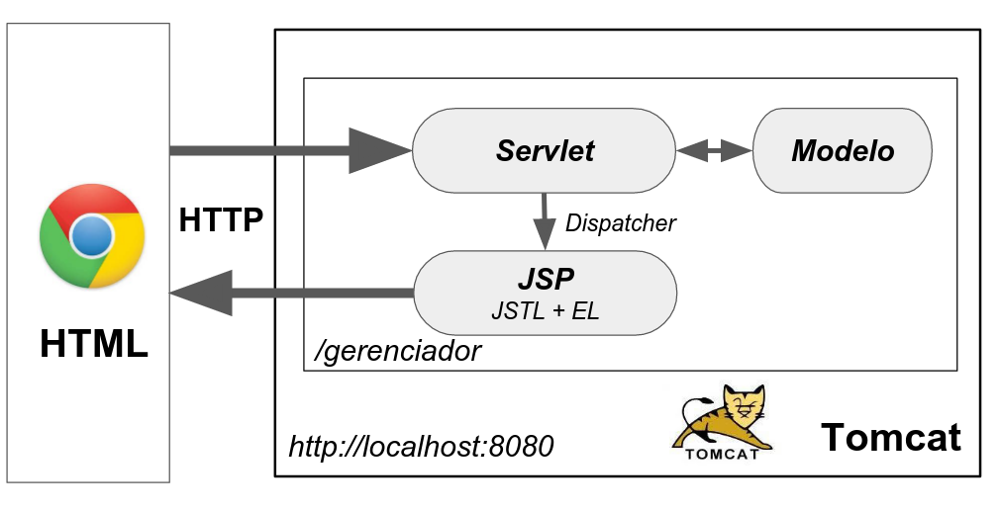

# Java Servlet: programação web Java



## Aula 1: 

- Apache Tomcat ou apenas Tomcat é um servidor web em Java
- Tomcat entende o protocolo HTTP e roda por padrão no http://localhost:8080
- O projeto Java faz parte da URL, no nosso caso: http://localhost:8080/gerenciador
- Uma aplicação web Java pode ter páginas HTML
- Uma servlet é um objeto Java que podemos chamar a partir de uma requisição HTTP
- Para mapear a URL para uma servlet usamos a anotação @WebServlet
- Uma servlet deve estender a classe HttpServlet e sobrescrever um determinado método (por exemplo service)

## Aula 2: 

- escrever uma servlet que atende apenas GET ou POST
- ler parâmetros da requisição dentro da servlet
- criar um formulário HTML usando as tags form e input
- enviando os dados pelo formulário através do POST
- diferença entre GET e POST

## Aula 3: 


- Nessa aula preparamos o modelo da nossa aplicação. O modelo ou domínio são as classes que representam o mundo real, aquilo que o cliente ou usuário da aplicação define.

- Para descobrir quais são as classes e funcionalidades do modelo o analista de requisitos conversa com o cliente e documenta cada funcionalidade.


## Aula 4: 

- JSP significa Java Server Pages
- JSP é uma página automaticamente processada pelo Tomcat
- Para gerar HTML dinamicamente no JSP usamos Scriptlets
- Um scriptlet <% %> é um código Java dentro do HTML
- Um scriptlet só funciona em uma página JSP
- Usamos o RequestDispatcher para chamar um JSP a partir da servlet
- Obtemos o RequestDispatcher a partir do HttpServletRequest
- Usamos a requisição para colocar ou pegar um atributo (setAttribute(.., ..) ou getAttribute(..))

## Aula 5: 

- Expression Language (EL) é uma linguagem simples e limitada para imprimir o - resultado de uma expressão
- EL usa a sintaxe de ${ .. }
- JSTL é a biblioteca padrão de tags
- JSTL não vem com Tomcat e precisamos copiar um JAR
- JSTL define 4 taglibs, as mais importantes são core e fmt
- a taglib core serve para controle de fluxo, fmt para formatação
- é preciso importar as taglib, core e fmt separadamente:

## Aula 6: 

- o problema de reenviar uma requisição
- a diferença entre redirecionamento pelo cliente e servidor
- para redirecionar pelo navegador usamos o método response.sendRedirect("endereço")
- o código de resposta para redirecionamento HTTP é 30X (301 ou 302)

## Aula 7: 

- Como implementar a remoção de empresas
- Como implementar a edição de empresas
- Qual atributo correto devemos utilizar para identificação dos elementos (id)
- Como definir um input escondido
- O que significa CRUD

## Aula 8: 

- A importância do web.xml
- O que é inversão de controle
- Como o Tomcat trabalha por debaixo dos panos
- Como inicializar o Tomcat na linha de comando
- Como gerar o WAR (Web ARchive)
- Como fazemos o deploy da nossa aplicação

###  Uma servlet, várias URLs

Através da anotação @WebServlet podemos definir mais do que uma URL para chamar o servlet, por exemplo:

```
@WebServlet(urlPatterns= {"/listaEmpresas", "/empresas"})
public class ListaEmpresasServlet extends HttpServlet {
```

O mesmo é possível pelo web.xml, no entanto muito mais trabalhoso:
```
  <servlet>
      <servlet-name>LES</servlet-name>
      <servlet-class>br.com.alura.gerenciador.servlet.ListaEmpresasServlet</servlet-class>
  </servlet>

  <servlet-mapping>
      <servlet-name>LES</servlet-name>
      <url-pattern>/listaEmpresas</url-pattern>
  </servlet-mapping>

  <servlet-mapping>
      <servlet-name>LES</servlet-name>
      <url-pattern>/empresas</url-pattern>
  </servlet-mapping>
```
Repare como o uso das anotações simplificaram as configurações!